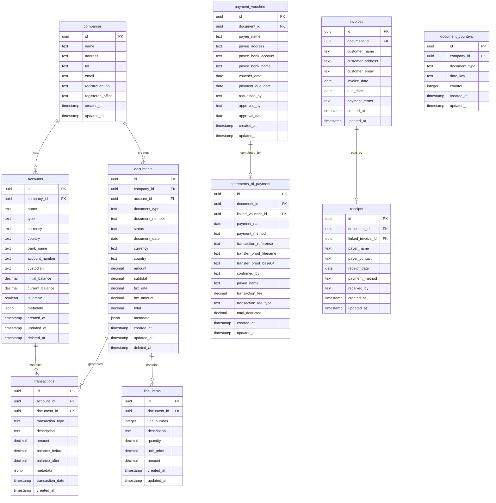

# WIF Financial System - Database Schema Design

## Overview
Migration from localStorage to Supabase/PostgreSQL for the Malaysia-Japan financial document management system.

---

## Entity Relationship Diagram



---

## Table Definitions

### 1. companies
**Purpose:** Multi-tenancy support, company information

```sql
CREATE TABLE companies (
    id UUID PRIMARY KEY DEFAULT gen_random_uuid(),
    name TEXT NOT NULL,
    address TEXT,
    tel TEXT,
    email TEXT,
    registration_no TEXT,
    registered_office TEXT,
    created_at TIMESTAMPTZ DEFAULT NOW(),
    updated_at TIMESTAMPTZ DEFAULT NOW()
);

CREATE INDEX idx_companies_name ON companies(name);
```

---

### 2. accounts
**Purpose:** Bank accounts and petty cash accounts

```sql
CREATE TABLE accounts (
    id UUID PRIMARY KEY DEFAULT gen_random_uuid(),
    company_id UUID NOT NULL REFERENCES companies(id) ON DELETE CASCADE,
    name TEXT NOT NULL,
    type TEXT NOT NULL CHECK (type IN ('main_bank', 'petty_cash')),
    currency TEXT NOT NULL CHECK (currency IN ('MYR', 'JPY')),
    country TEXT NOT NULL CHECK (country IN ('Malaysia', 'Japan')),
    bank_name TEXT,
    account_number TEXT,
    custodian TEXT,
    initial_balance DECIMAL(15,2) NOT NULL DEFAULT 0,
    current_balance DECIMAL(15,2) NOT NULL DEFAULT 0,
    is_active BOOLEAN DEFAULT TRUE,
    metadata JSONB,
    notes TEXT,
    created_at TIMESTAMPTZ DEFAULT NOW(),
    updated_at TIMESTAMPTZ DEFAULT NOW(),
    deleted_at TIMESTAMPTZ
);

CREATE INDEX idx_accounts_company ON accounts(company_id);
CREATE INDEX idx_accounts_active ON accounts(is_active) WHERE deleted_at IS NULL;
CREATE INDEX idx_accounts_currency ON accounts(currency);

-- Constraint: bank accounts must have bank_name
ALTER TABLE accounts ADD CONSTRAINT check_bank_account_fields
    CHECK (type != 'main_bank' OR bank_name IS NOT NULL);

-- Constraint: petty cash must have custodian
ALTER TABLE accounts ADD CONSTRAINT check_petty_cash_fields
    CHECK (type != 'petty_cash' OR custodian IS NOT NULL);
```

---

### 3. documents
**Purpose:** Base table for all document types (polymorphic)

```sql
CREATE TABLE documents (
    id UUID PRIMARY KEY DEFAULT gen_random_uuid(),
    company_id UUID NOT NULL REFERENCES companies(id) ON DELETE CASCADE,
    account_id UUID REFERENCES accounts(id) ON DELETE SET NULL,
    document_type TEXT NOT NULL CHECK (
        document_type IN ('invoice', 'receipt', 'payment_voucher', 'statement_of_payment')
    ),
    document_number TEXT NOT NULL,
    status TEXT NOT NULL CHECK (
        status IN ('draft', 'issued', 'paid', 'completed', 'cancelled')
    ),
    document_date DATE NOT NULL,
    currency TEXT NOT NULL CHECK (currency IN ('MYR', 'JPY')),
    country TEXT NOT NULL CHECK (country IN ('Malaysia', 'Japan')),
    amount DECIMAL(15,2) NOT NULL,
    subtotal DECIMAL(15,2),
    tax_rate DECIMAL(5,2),
    tax_amount DECIMAL(15,2),
    total DECIMAL(15,2),
    notes TEXT,
    metadata JSONB,
    created_at TIMESTAMPTZ DEFAULT NOW(),
    updated_at TIMESTAMPTZ DEFAULT NOW(),
    deleted_at TIMESTAMPTZ,

    UNIQUE(company_id, document_number)
);

CREATE INDEX idx_documents_company ON documents(company_id);
CREATE INDEX idx_documents_type ON documents(document_type);
CREATE INDEX idx_documents_status ON documents(status);
CREATE INDEX idx_documents_date ON documents(document_date);
CREATE INDEX idx_documents_account ON documents(account_id);
CREATE INDEX idx_documents_active ON documents(company_id, document_type, status)
    WHERE deleted_at IS NULL;
```

---

### 4. invoices
**Purpose:** Invoice-specific fields

```sql
CREATE TABLE invoices (
    id UUID PRIMARY KEY DEFAULT gen_random_uuid(),
    document_id UUID NOT NULL REFERENCES documents(id) ON DELETE CASCADE,
    customer_name TEXT NOT NULL,
    customer_address TEXT,
    customer_email TEXT,
    invoice_date DATE NOT NULL,
    due_date DATE NOT NULL,
    payment_terms TEXT,
    created_at TIMESTAMPTZ DEFAULT NOW(),
    updated_at TIMESTAMPTZ DEFAULT NOW(),

    UNIQUE(document_id)
);

CREATE INDEX idx_invoices_customer ON invoices(customer_name);
CREATE INDEX idx_invoices_due_date ON invoices(due_date);
```

---

### 5. receipts
**Purpose:** Receipt-specific fields

```sql
CREATE TABLE receipts (
    id UUID PRIMARY KEY DEFAULT gen_random_uuid(),
    document_id UUID NOT NULL REFERENCES documents(id) ON DELETE CASCADE,
    linked_invoice_id UUID REFERENCES invoices(id) ON DELETE SET NULL,
    payer_name TEXT NOT NULL,
    payer_contact TEXT,
    receipt_date DATE NOT NULL,
    payment_method TEXT NOT NULL,
    received_by TEXT NOT NULL,
    created_at TIMESTAMPTZ DEFAULT NOW(),
    updated_at TIMESTAMPTZ DEFAULT NOW(),

    UNIQUE(document_id)
);

CREATE INDEX idx_receipts_invoice ON receipts(linked_invoice_id);
CREATE INDEX idx_receipts_payer ON receipts(payer_name);
```

---

### 6. payment_vouchers
**Purpose:** Payment voucher-specific fields

```sql
CREATE TABLE payment_vouchers (
    id UUID PRIMARY KEY DEFAULT gen_random_uuid(),
    document_id UUID NOT NULL REFERENCES documents(id) ON DELETE CASCADE,
    payee_name TEXT NOT NULL,
    payee_address TEXT,
    payee_bank_account TEXT,
    payee_bank_name TEXT,
    voucher_date DATE NOT NULL,
    payment_due_date DATE,
    requested_by TEXT NOT NULL,
    approved_by TEXT,
    approval_date DATE,
    created_at TIMESTAMPTZ DEFAULT NOW(),
    updated_at TIMESTAMPTZ DEFAULT NOW(),

    UNIQUE(document_id)
);

CREATE INDEX idx_payment_vouchers_payee ON payment_vouchers(payee_name);
CREATE INDEX idx_payment_vouchers_approved ON payment_vouchers(approved_by);
```

---

### 7. statements_of_payment
**Purpose:** Statement of payment-specific fields

```sql
CREATE TABLE statements_of_payment (
    id UUID PRIMARY KEY DEFAULT gen_random_uuid(),
    document_id UUID NOT NULL REFERENCES documents(id) ON DELETE CASCADE,
    linked_voucher_id UUID NOT NULL REFERENCES payment_vouchers(id) ON DELETE RESTRICT,
    payment_date DATE NOT NULL,
    payment_method TEXT NOT NULL,
    transaction_reference TEXT NOT NULL,
    transfer_proof_filename TEXT,
    transfer_proof_base64 TEXT, -- Consider moving to storage bucket
    confirmed_by TEXT NOT NULL,
    payee_name TEXT NOT NULL,
    transaction_fee DECIMAL(15,2) DEFAULT 0,
    transaction_fee_type TEXT,
    total_deducted DECIMAL(15,2) NOT NULL,
    created_at TIMESTAMPTZ DEFAULT NOW(),
    updated_at TIMESTAMPTZ DEFAULT NOW(),

    UNIQUE(document_id),
    UNIQUE(linked_voucher_id) -- One statement per voucher
);

CREATE INDEX idx_sop_voucher ON statements_of_payment(linked_voucher_id);
CREATE INDEX idx_sop_reference ON statements_of_payment(transaction_reference);
```

---

### 8. line_items
**Purpose:** Line items for documents (invoices, payment vouchers, etc.)

```sql
CREATE TABLE line_items (
    id UUID PRIMARY KEY DEFAULT gen_random_uuid(),
    document_id UUID NOT NULL REFERENCES documents(id) ON DELETE CASCADE,
    line_number INTEGER NOT NULL,
    description TEXT NOT NULL,
    quantity DECIMAL(10,2) NOT NULL DEFAULT 1,
    unit_price DECIMAL(15,2) NOT NULL,
    amount DECIMAL(15,2) NOT NULL,
    created_at TIMESTAMPTZ DEFAULT NOW(),
    updated_at TIMESTAMPTZ DEFAULT NOW(),

    UNIQUE(document_id, line_number)
);

CREATE INDEX idx_line_items_document ON line_items(document_id);
```

---

### 9. transactions
**Purpose:** Financial transaction audit trail

```sql
CREATE TABLE transactions (
    id UUID PRIMARY KEY DEFAULT gen_random_uuid(),
    account_id UUID NOT NULL REFERENCES accounts(id) ON DELETE CASCADE,
    document_id UUID NOT NULL REFERENCES documents(id) ON DELETE CASCADE,
    transaction_type TEXT NOT NULL CHECK (transaction_type IN ('increase', 'decrease')),
    description TEXT NOT NULL,
    amount DECIMAL(15,2) NOT NULL,
    balance_before DECIMAL(15,2) NOT NULL,
    balance_after DECIMAL(15,2) NOT NULL,
    metadata JSONB,
    transaction_date TIMESTAMPTZ NOT NULL DEFAULT NOW(),
    created_at TIMESTAMPTZ DEFAULT NOW()
);

CREATE INDEX idx_transactions_account ON transactions(account_id, transaction_date DESC);
CREATE INDEX idx_transactions_document ON transactions(document_id);
CREATE INDEX idx_transactions_date ON transactions(transaction_date);
```

---

### 10. document_counters
**Purpose:** Auto-increment document numbers per type per day

```sql
CREATE TABLE document_counters (
    id UUID PRIMARY KEY DEFAULT gen_random_uuid(),
    company_id UUID NOT NULL REFERENCES companies(id) ON DELETE CASCADE,
    document_type TEXT NOT NULL,
    date_key TEXT NOT NULL, -- Format: YYYYMMDD
    counter INTEGER NOT NULL DEFAULT 0,
    created_at TIMESTAMPTZ DEFAULT NOW(),
    updated_at TIMESTAMPTZ DEFAULT NOW(),

    UNIQUE(company_id, document_type, date_key)
);

CREATE INDEX idx_counters_lookup ON document_counters(company_id, document_type, date_key);
```

---

## Database Functions & Triggers

### 1. Auto-update updated_at timestamp

```sql
CREATE OR REPLACE FUNCTION update_updated_at_column()
RETURNS TRIGGER AS $$
BEGIN
    NEW.updated_at = NOW();
    RETURN NEW;
END;
$$ LANGUAGE plpgsql;

-- Apply to all tables
CREATE TRIGGER update_companies_updated_at BEFORE UPDATE ON companies
    FOR EACH ROW EXECUTE FUNCTION update_updated_at_column();

CREATE TRIGGER update_accounts_updated_at BEFORE UPDATE ON accounts
    FOR EACH ROW EXECUTE FUNCTION update_updated_at_column();

CREATE TRIGGER update_documents_updated_at BEFORE UPDATE ON documents
    FOR EACH ROW EXECUTE FUNCTION update_updated_at_column();

-- ... apply to all other tables
```

---

### 2. Auto-create transaction on document completion

```sql
CREATE OR REPLACE FUNCTION create_transaction_on_document_complete()
RETURNS TRIGGER AS $$
DECLARE
    v_account accounts%ROWTYPE;
    v_amount DECIMAL(15,2);
    v_txn_type TEXT;
    v_description TEXT;
BEGIN
    -- Only process receipts and statements of payment with 'completed' status
    IF NEW.status = 'completed' AND NEW.account_id IS NOT NULL THEN
        IF NEW.document_type = 'receipt' THEN
            -- Receipt increases balance
            v_amount := NEW.amount;
            v_txn_type := 'increase';
            v_description := 'Payment received';

        ELSIF NEW.document_type = 'statement_of_payment' THEN
            -- Statement of payment decreases balance
            SELECT total_deducted INTO v_amount
            FROM statements_of_payment
            WHERE document_id = NEW.id;

            v_txn_type := 'decrease';
            v_description := 'Payment made';

        ELSE
            RETURN NEW;
        END IF;

        -- Get account and update balance
        SELECT * INTO v_account FROM accounts WHERE id = NEW.account_id FOR UPDATE;

        -- Create transaction record
        INSERT INTO transactions (
            account_id,
            document_id,
            transaction_type,
            description,
            amount,
            balance_before,
            balance_after,
            transaction_date
        ) VALUES (
            NEW.account_id,
            NEW.id,
            v_txn_type,
            v_description,
            v_amount,
            v_account.current_balance,
            v_account.current_balance + CASE WHEN v_txn_type = 'increase' THEN v_amount ELSE -v_amount END,
            NOW()
        );

        -- Update account balance
        UPDATE accounts
        SET current_balance = current_balance + CASE WHEN v_txn_type = 'increase' THEN v_amount ELSE -v_amount END
        WHERE id = NEW.account_id;
    END IF;

    RETURN NEW;
END;
$$ LANGUAGE plpgsql;

CREATE TRIGGER create_transaction_trigger
AFTER INSERT OR UPDATE OF status ON documents
FOR EACH ROW
EXECUTE FUNCTION create_transaction_on_document_complete();
```

---

### 3. Generate document number

```sql
CREATE OR REPLACE FUNCTION generate_document_number(
    p_company_id UUID,
    p_document_type TEXT
) RETURNS TEXT AS $$
DECLARE
    v_prefix TEXT;
    v_date_key TEXT;
    v_counter INTEGER;
    v_document_number TEXT;
BEGIN
    -- Determine prefix
    v_prefix := CASE p_document_type
        WHEN 'invoice' THEN 'INV'
        WHEN 'receipt' THEN 'RCP'
        WHEN 'payment_voucher' THEN 'PV'
        WHEN 'statement_of_payment' THEN 'SOP'
        ELSE 'DOC'
    END;

    -- Get current date key
    v_date_key := TO_CHAR(CURRENT_DATE, 'YYYYMMDD');

    -- Get and increment counter
    INSERT INTO document_counters (company_id, document_type, date_key, counter)
    VALUES (p_company_id, p_document_type, v_date_key, 1)
    ON CONFLICT (company_id, document_type, date_key)
    DO UPDATE SET counter = document_counters.counter + 1
    RETURNING counter INTO v_counter;

    -- Format: WIF-PREFIX-YYYYMMDD-XXX
    v_document_number := 'WIF-' || v_prefix || '-' || v_date_key || '-' || LPAD(v_counter::TEXT, 3, '0');

    RETURN v_document_number;
END;
$$ LANGUAGE plpgsql;
```

---

### 4. Validate account balance before payment

```sql
CREATE OR REPLACE FUNCTION validate_payment_balance()
RETURNS TRIGGER AS $$
DECLARE
    v_account_balance DECIMAL(15,2);
    v_payment_amount DECIMAL(15,2);
BEGIN
    IF NEW.document_type = 'statement_of_payment' AND NEW.status = 'completed' THEN
        -- Get account balance
        SELECT current_balance INTO v_account_balance
        FROM accounts
        WHERE id = NEW.account_id;

        -- Get total deducted amount
        SELECT total_deducted INTO v_payment_amount
        FROM statements_of_payment
        WHERE document_id = NEW.id;

        -- Validate sufficient balance
        IF v_account_balance < v_payment_amount THEN
            RAISE EXCEPTION 'Insufficient balance: Account has % but payment requires %',
                v_account_balance, v_payment_amount;
        END IF;
    END IF;

    RETURN NEW;
END;
$$ LANGUAGE plpgsql;

CREATE TRIGGER validate_payment_trigger
BEFORE INSERT OR UPDATE ON documents
FOR EACH ROW
EXECUTE FUNCTION validate_payment_balance();
```

---

## Row Level Security (RLS) Policies

```sql
-- Enable RLS on all tables
ALTER TABLE companies ENABLE ROW LEVEL SECURITY;
ALTER TABLE accounts ENABLE ROW LEVEL SECURITY;
ALTER TABLE documents ENABLE ROW LEVEL SECURITY;
ALTER TABLE invoices ENABLE ROW LEVEL SECURITY;
ALTER TABLE receipts ENABLE ROW LEVEL SECURITY;
ALTER TABLE payment_vouchers ENABLE ROW LEVEL SECURITY;
ALTER TABLE statements_of_payment ENABLE ROW LEVEL SECURITY;
ALTER TABLE line_items ENABLE ROW LEVEL SECURITY;
ALTER TABLE transactions ENABLE ROW LEVEL SECURITY;
ALTER TABLE document_counters ENABLE ROW LEVEL SECURITY;

-- Example policy: Users can only access their company's data
CREATE POLICY company_isolation_policy ON documents
    FOR ALL
    USING (company_id = (auth.jwt() ->> 'company_id')::UUID);

-- Similar policies for other tables...
```

---

## Migration Strategy

### Phase 1: Setup
1. Create Supabase project
2. Run all schema migrations
3. Set up RLS policies
4. Create service role for migration

### Phase 2: Data Migration
```javascript
// Migration script pseudocode
async function migrateFromLocalStorage() {
    // 1. Create company
    const company = await createCompany({
        name: 'WIF JAPAN SDN BHD',
        // ... other details
    });

    // 2. Migrate accounts
    const accountMap = new Map();
    for (const account of localStorage.accounts) {
        const newAccount = await supabase
            .from('accounts')
            .insert({
                company_id: company.id,
                ...account
            });
        accountMap.set(account.id, newAccount.id);
    }

    // 3. Migrate documents
    for (const doc of localStorage.documents) {
        // Create base document
        const document = await supabase
            .from('documents')
            .insert({
                company_id: company.id,
                account_id: accountMap.get(doc.accountId),
                ...doc
            });

        // Create type-specific record
        if (doc.documentType === 'invoice') {
            await supabase.from('invoices').insert({
                document_id: document.id,
                ...invoiceFields
            });
        }

        // Create line items
        for (const item of doc.items) {
            await supabase.from('line_items').insert({
                document_id: document.id,
                ...item
            });
        }
    }
}
```

### Phase 3: Validation
1. Compare record counts
2. Validate balances
3. Test workflows
4. Run parallel for safety period

### Phase 4: Cutover
1. Switch app to Supabase
2. Monitor for issues
3. Keep localStorage backup
4. Sunset localStorage after 30 days

---

## Storage for File Attachments

```sql
-- Instead of storing base64 in database, use Supabase Storage

-- Create bucket
CREATE BUCKET transfer_proofs (
    public = false,
    file_size_limit = 10485760 -- 10MB
);

-- Update statements_of_payment table
ALTER TABLE statements_of_payment
    DROP COLUMN transfer_proof_base64,
    ADD COLUMN transfer_proof_storage_path TEXT;

-- Storage path format: {company_id}/{document_id}/{filename}
```

---

## Performance Optimizations

1. **Indexes**: Already defined on foreign keys and common queries
2. **Partitioning**: Consider partitioning `transactions` by year
3. **Materialized Views**: For balance sheets and reports
4. **Connection Pooling**: Use Supabase connection pooler
5. **Caching**: Redis for document counters

---

## Backup & Recovery

1. **Point-in-time recovery**: Enabled by default on Supabase
2. **Daily backups**: Automated
3. **Export scripts**: Regular JSON exports
4. **Disaster recovery**: Multi-region replication

---

This schema provides:
✅ Strong data integrity with foreign keys
✅ Audit trails with timestamps
✅ Soft deletes for recovery
✅ Automatic transaction creation
✅ Balance validation
✅ Multi-currency support
✅ Document workflow enforcement
✅ Scalability for growth
